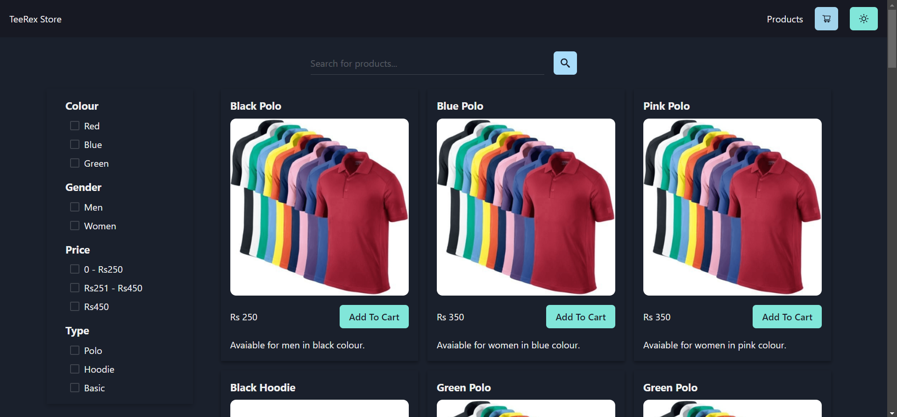
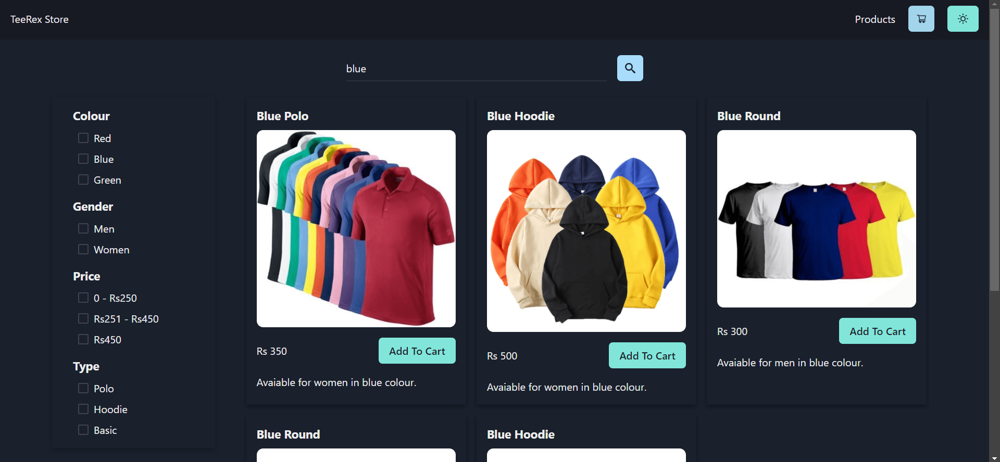
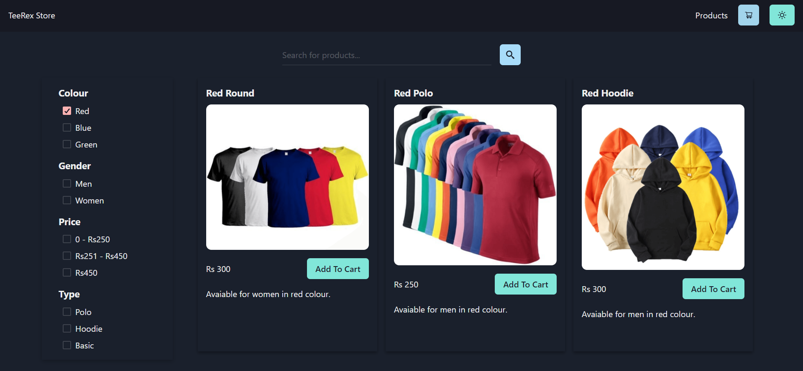

# Background

### King Shan wants to start a t-shirt business, where he sells t-shirts online. To run his business, he needs a simple webapp where customers can browse through the catalog of t-shirts, add t-shirts to the shopping cart and checkout the items in the cart.

# Task

### Your job is to build a simple UI, which allows a customer to do the following:-

- Browse the catalog on a product listing page
- Each card should have the image, name and price.
- Search using free text which is a combination of one or more of the below attributes
  - Name
  - Colour
  - Type
  - Eg. green polo
- Filter for t-shirts using specific attributes
  - Gender
  - Colour
  - Price range
  - Type
- Add one or more t-shirts to the shopping cart
- View the shopping cart by clicking the shopping cart icon
- Increase quantity or delete items from the shopping cart
- Display the total amount in the shopping cart.

# Rules

- Every t-shirt type has a limited quantity. If the customer tries to order more than the available quantity, an error message should appear.
- Filter can be applied by itself or on top of the search results.
- Filters and Search need not be retained on navigation between pages, But the items in the cart should be retained.
- The mockup provided is only a sample so that you have an indication of what is expected from you. You could choose to go with a completely different user experience. But you will need to ensure that all requirements mentioned in the problem are covered & there should be navigation between screens.
- All features (search, filter, add to cart etc) should be handled on the client side.
- There are no API's provided for these features.
- There is no need to handle pagination.
- There is no need to implement user registration / login.
- [API](https://geektrust.s3.ap-southeast-1.amazonaws.com/coding-problems/shopping-cart/catalogue.json) link (GET request)

# Screenshots

### 1. Products Page

### 2. Search Results

### 3. Filter Options

### 4. Cart Page

